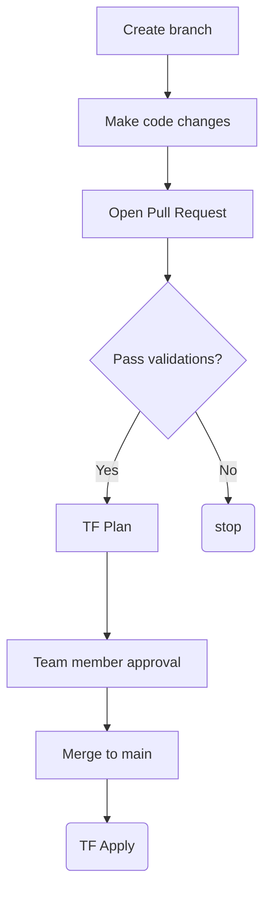

<!-- markdownlint-disable MD034 -->
- [New Runway Shared AKS Clusters](#new-runway-shared-aks-clusters)
- [Configuration](#configuration)
  - [File and Folder Breakdown](#file-and-folder-breakdown)
   - [Folders](#folders)
   - [Files](#files)
     - [Backend File](#backend-file)
     - [Cluster File](#cluster-file)
     - [Bootstrap Cluster File](#bootstrap-cluster-file)
- [New Cluster Creation](#new-cluster-creation)
  - [Backend Config](#backend-config)
  - [Cluster Config](#cluster-config)
  - [Create cluster using Terraform](#create-cluster-using-terraform)
    - [Cluster create flow](#cluster-create-flow)
  - [Cluster creation without ArgoCD](#cluster-creation-without-argocd)
- [Validation after Cluster Creation](#validation-after-cluster-creation)
- [Integrate New Cluster's PIP With Gateway Load Balancer](#integrate-new-clusters-pip-with-gateway-load-balancer)
- [Terraform State Move](#terraform-state-move)
- [Destroy the Cluster](#destroy-the-cluster)
- [Upgrade Terraform Provider](#upgrade-terraform-provider)
# New Runway Shared AKS Clusters

> Oh, this is super easy!

## Configuration

All the cluster configurations are stored in `terraform/config/`. The majority of the cluster configuration is managed through Terraform. There are several dynamic lookups using `data` resource types from the Azure provider. However, there are some items that have to be known:

### File and Folder Breakdown

To help with automation, there is a naming approach to the underlying variable files used for Terraform commands, as well as other scripts.

#### Folders

The folder structure is as follows, under `terraform/config/`:

```text
clusters/
  <oneOf:prod|non-prod|lab>/
    cluster<int3:clusterNumber>
```

> A folder example: `terraform/config/clusters/non-prod/cluster2002`

#### Files

Each cluster folder has two files and two additional files based on the requirement. If the cluster exists in two regions `eastus` and `westus`, there will be four files:

```text
backend-config-<int3:clusterNumber>-<REGION>.tfvars
runway-<int3:clusterNumber>-<REGION>.tfvars
```

These two discrete files are used for the configuration of a cluster.

##### Backend File

This file allows the backend to be parameterized and not hard coded in the actual TF files. The `backend-config-<clusterNumber>-<region>.tfvars` file is only used during the `terraform init` step. This allows the Terraform binary to pull necessary dependencies, install plugins/providers, and to initialize the backend with the right details.

##### Cluster File

The cluster is configured through the `runway-<clusterNumber>-<REGION>.tfvars` file. This includes the parameters needed to direct TF during the `plan` and `apply` steps.

##### Bootstrap Cluster File

A cluster can be bootstrapped as part of cluster creation which would install required components based on the cluster type. In order to bootstrap the cluster, a folder has to be created for the cluster at `bootstrap-next/clusters/<ENV>/<CLUSTERNAME>` with a kustomization file with resources pointing to the type of cluster in `bootstrap-next/argocd-apps` folder. Below is an example of where the directory and how the `kustomization.yaml` looks like for a lab runway shared cluster. See more [here](https://github.com/AAInternal/runway-kubernetes-cluster-automation/tree/main/bootstrap-next#onboarding-a-cluster-to-bootstrapping)

```bash
mkdir bootstrap-next/clusters/lab/kaas-runway-lab-aks-1002-westus
touch bootstrap-next/clusters/lab/kaas-runway-lab-aks-1002-westus/kustomization.yaml
```
***kustomization.yaml***
```
---
resources:
  - "../../../argocd-apps/lab/runway"

```

## New Cluster Creation

1. Determine if the cluster is lab, non-prod or prod.
2. Assign a new cluster number based on the naming conventions [here](https://github.com/AAInternal/runway-kubernetes-cluster-automation/blob/main/docs/squad-docs/kpaas-clusters/0V2_KPaaS_Clusters-list.md)
3. Get the available [subnets](https://github.com/AAInternal/runway-kubernetes-cluster-automation/wiki/New-AKS-subnets) from here and select accordingly as per the location
    - Update the wiki once you reserved the subnet with relative cluster name
4. Create a branch and then create required tfvars

### Backend Config

|When|Key|Value|
|---|---|---|
|Prod|||
||`storage_account_name`|`dxrunwayp001`|
||`resource_group_name`|`dx-runway-core`|
||`key`|`kaas-runway-core-<clusterNumber>`|
|Non-Prod|||
||`storage_account_name`|`dxrunwaynp001`|
||`resource_group_name`|`dx-runway-core-np`|
||`key`|`kaas-runway-core-<clusterNumber>`|
|lab|||
||`storage_account_name`|`dxrunwaynp001`|
||`resource_group_name`|`dx-runway-core-np`|
||`key`|`kaas-runway-core-<clusterNumber>`|

> The `container_name` should stay as `tfstate`

```hcl
### lab cluster backend tfvars file
storage_account_name = "dxrunwaynp001"
resource_group_name  = "dx-runway-core-np"
container_name       = "tfstate"
key                  = "kaas-runway-lab-<CLUSTERNUM>-<REGION>"
```

```hcl
### non-prod cluster backend tfvars file
storage_account_name = "dxrunwaynp001"
resource_group_name  = "dx-runway-core-np"
container_name       = "tfstate"
key                  = "kaas-runway-np-<CLUSTERNUM>-<REGION>"
```

```hcl
### prod cluster backend tfvars file
storage_account_name = "dxrunwayp001"
resource_group_name  = "dx-runway-core-prod"
container_name       = "tfstate"
key                  = "kaas-runway-p-<CLUSTERNUM>-<REGION>"
```

### Cluster Config

|When|Key|Value|Notes|
|---|---|---|---|
|Always|||
||`devexp_cluster_num`|`<CLUSTER_NUMBER>`|4 digit number|
||`asset_resource_group_name`|`<RESOURCE_GROUP_NAME>`|
||`ets_subnet_name`|`<SUBNET_NAME>`|
||`ets_vnet_name`|`<VNET_NAME>`|
||`ets_next_hop_ip`|`10.227.250.5`|Palo Alto device pool IP|
||`cluster_resource_group_name`|`ets-network-rg`|Network team currently sets this|
||`kubernetes_version`|`<K8s_VERSION>`|
||`subnet`|`<findAvailableSubnet>`|Pick open subnet in vnet|
||`runway.aa.com/status`|`<status>`|active/inactive/readonly|

> Note: `ets_next_hop_ip` are the same for subscriptions as this is the IP for Palo Alto

> Note: Add labels to cluster when installing Rancher Agent "runway.aa.com/status:" active/inactive/readonly

**NOTE:** new cluster should have the following parameters:

- Make Sure you add Availability Zones `eastus = ["1", "2", "3"]` for `EAST US` region in `clusternumber.tfvars`

### Create cluster using Terraform

- Validate the TFplan if everything is creating as expected then merge PR to main (PR must be approved)
- Now run cluster create workflow from main,this cluster creation wf process will create the cluster along with Argo CD app, Cluster Registered into Rancher & few system components NS

#### Cluster create flow



- Run [0-v2--FLOW-create-cluster](https://github.com/AAInternal/runway-kubernetes-cluster-automation/actions/workflows/v2--FLOW-create-cluster.yaml) to create new cluster
  - Examples to run the gh cli commands:

```sh
gh workflow run -R AAInternal/runway-kubernetes-cluster-automation v2--FLOW-create-cluster.yaml  \
  -f targetCluster=$RUNWAY_NEW_CLUSTER \
  -f targetEnvironment=$RUNWAY_ENVIRONMENT \
  -f targetRegionLocation=$RUNWAY_LOCATION
```

- This above step required approval to apply the changes and create cluster (must be approved by peer, do not self approve) reference screenshot below

- 

- New cluster will be created with 2 node pools, a system node pool used to schedule only Kube workload, a gen01 node pool which is used to schedule customer workload and a gen02 node pool which is used to schedule only bootstrap components workload such as ArgoCD, ingress controller, Kuma service mesh etc.

#### Cluster creation without argocd

- The above mentioned process would create cluster along with Argo CD app, Cluster Registered into Rancher & few system components. However, if you want to create a cluster without ArgoCD apps, there is another workflow you can run

- Run [0-v2-terraform-plan-apply](https://github.com/AAInternal/runway-kubernetes-cluster-automation/actions/workflows/v2-run-terraform-apply.yaml)
- If any changes made for existing cluster then  run the same above workflow [v2-run-terraform-apply.yaml]([0-v2-terraform-plan-apply](https://github.com/AAInternal/runway-kubernetes-cluster-automation/actions/workflows/v2-run-terraform-apply.yaml))

 Examples to run the gh cli commands:

```sh
gh workflow run -R AAInternal/runway-kubernetes-cluster-automation v2-run-terraform-apply.yaml  \
  -f targetCluster=$RUNWAY_NEW_CLUSTER \
  -f targetEnvironment=$RUNWAY_ENVIRONMENT \
  -f targetRegionLocation=$RUNWAY_LOCATION
```

## Validation after cluster creation

**Note:** Download the KUBECONFIG file for the newly created cluster which will be used for many of the steps.

- [x] Verify cluster in azure
- [x] Verify that the new cluster is listed in Rancher UI
  - lab- https://master-drke.ok8s.aa.com/
  - nonprod- https://master-nprke.ok8s.aa.com/
  - prod- https://master-rke.ok8s.aa.com/
  - see if the cluster is pending (or) seeing the message "cluster agent is not connected"
  - check cattle system namespace pods
- [ ] Verify that the cluster shows up in the correct Rancher fleet group (the east cluster should go to the east fleet group and so on)
- [x] All bootstrap components must be scheduled on `gen02` nodepool
  - `kubectl get po -n <ns-name> -o wide`
- [x] Ensure Argo CD pods are running and port-forward ArgoCD UI `kubectl port-forward service/argocd-server 8080:80 -n dx-argocd`, Access to [local host](http://localhost:8080/)
  - All the system components are synced and healthy in Argo UI
-[x] Validate that the newly created cluster is added to the right global kuma control-plane cluster based on the environment
  - **Lab**
    - `kubectl port-forward service/kuma-control-plane 5681:5681 -n kuma-system --context=dx-runway-np-aks-1101-eastus`
  - **non-prod**
    - `kubectl port-forward service/kuma-control-plane 5681:5681 -n kuma-system --context=dx-runway-np-aks-2101-eastus`
  - **prod**
    - `kubectl port-forward service/kuma-control-plane 5681:5681 -n kuma-system --context=dx-runway-np-aks-9000-eastus`
  - access the kuma UI on the global mesh cluster [local host](http://localhost:5681/gui)
  - [x] Check pods are up with Kuma sidecar in the below deployments **We should see two containers per pod.**
  - Ensure Ingress controller,apigee,synthetics,runway-operator pods have kuma-sidecar
  (2/2), forexample:
  - `kubectl get all -n ingress-nginx --context=RUNWAY_NEW_CLUSTER_CONTEXT`

    - [ ] Make sure to check that the newly created cluster is registered in both Mezmo and Dynatrace
  - Mezmo: https://app.mezmo.com/
    - The cluster should show up as a Mezmo source.
    - fluentbit from logging namespace is registering cluster in Mezmo.
  - Dynatrace:
    - Prod: https://aa-prod.live.dynatrace.com/
    - Non-Prod: https://aa-nonprod.live.dynatrace.com/
      - active-gate pods from dynatrace namespace registers the cluster in dynatrace SaaS
      - The cluster should show up under `Infrastructure Observability` - `Kubernetes`

- [x] `kubectl get ing -A` and Check the ingresses are created and the Akamai entries are populated.
  - **Notes**:
    - Login to the Akamai and check for the properties.(https://control.akamai.com/)
    - If you are able to access the ingress endpoints, that basically means that there is an entry in akamai.<br>
- **note:** This below step is required only if GTM sync service is not creating Akamai properties.
  - Add dummy annotations to the ingresses to force them to sync up through gtm-sync and Akamai and check Akamai for entries.

```sh
$ kubectl annotate ingress triggerGTMUpdate=$(date +"%Y%m%dT%H%M%S%z") --all --all-namespaces --context=RUNWAY_NEW_CLUSTER_CONTEXT
```

- **Note**: If you don't see argo-cd entries in Akamai, validate the *gtm-sync* and *runway-operator* logs and create the manual entry using `curl` command as mentioned in https://github.com/AAInternal/runway-kubernetes-cluster-automation/wiki/Tips#:~:text=xxx%2Dxxxxus%0Adone-,GTM%2DSync,-How%20to%20use.

- Run Cluster validation suite using in testkube
- Verify testkube pods are up
- run `testkube dashboard -n testkube` on newly created cluster to access testkube dashboard
- Run Cluster-validation test suite in testkube dashboard

- The cluster should be stable at this point.

### Integrate New Cluster's PIP With Gateway Load Balancer

**Please follow below steps to integrate GLB:**

- Log in to Azure portal and type the new cluster's name in the search box
- Click on the cluster name and on the left panel click on the properties
- In the new window click on custom resource group link that starts with MC-xxx (note the custom RG name)
- Click on the Kubernetes load balancer
- On the left panel click on frontend IP configuration
- In the new window copy the name of the frontend IP that starts with dxclusters-externalips-xxx
- Now go to GitHub Actions and run this [workflow](https://github.com/AAInternal/runway-kubernetes-cluster-automation/actions/workflows/gateway-lb-integration.yaml). Make sure to insert the custorm resource group and frontend IP names that are required for the workflow.
- When the workflow is completed, go back and validate that the GLB is attached to the frontend IP.

# Terraform State Move

During refactoring of Terraform code, sometimes a module or resource is renamed, or a new one is created to replace
a previous one. Most of the time, Terraform is smart enough to know that the underlying infrastructure should not
be recreated, but sometimes it will not be able to figure this out and instead you will see something like this:

```terraform
# azurerm_kubernetes_cluster_node_pool.general01[0] will be destroyed
# (because index [0] is out of range for count)
- resource "azurerm_kubernetes_cluster_node_pool" "general01" {
...
   + mode                  = "User"
   + name                  = "gen01"
...
}

# azurerm_kubernetes_cluster_node_pool.general_node_pools["gen01"] will be created
+ resource "azurerm_kubernetes_cluster_node_pool" "general_node_pools" {
...
   + mode                  = "User"
   + name                  = "gen01"
...
```

Terraform is creating a new resource and destroying an old one, but upon closer inspection the underlying
infrastructure ends up being the same, making this recreating unnecessarily disruptive. To address this, Terrraform
has the [state mv](https://developer.hashicorp.com/terraform/cli/commands/state/mv) command, which allows
the user to indicate that the existing infrastructure should be tracked by a different resource instance address.

> :warning: We should always aim to make our TF code changes backwards compatible during the transition period between
a refactoring from old code to new code. We should **never** be in a situation where a TF code change will immediately
cause a `terraform apply` in production to recreate infrastructure. Wherever possible, try to contain changes like that
with a feature flag or a TF variable.

For our clusters, we have added a workflow called [terraform-state-mv](../.github/workflows/terraform-state-mv.yaml)
that is capable of doing the hard work of modifying existing state for us. The full process for this operation is as follows:

1. Create a PR that modifies a cluster's TF variables or will otherwise cause a change in the plan output where infrastructure
   can be safely moved to a new resource instance.
2. Run the [Terraform state move workflow](https://github.com/AAInternal/runway-kubernetes-cluster-automation/actions/workflows/terraform-state-mv.yaml) and
   specify the following parameters: the branch name used on your PR, cluster number, cluster environment, cluster region, PR number, and source and destination
   resouces instances.
3. Against the changes in your PR, a `terraform state mv` dry run will be run and its output placed as a comment in the PR. Please review the changes before
   approving of the state modification.
4. After approving the workflow, a real state modification will be performed.
5. The comment on the PR will be updated with the results of the state modification, followed by a `terraform plan` of the cluster's current state. Ensure
   that the plan output is clean and that the resources modified are not present as a incoming change to the underlying infrastructure.

# [Destroy the cluster](https://github.com/AAInternal/runway-kubernetes-cluster-automation/blob/main/upgrade-k8s/decommision-steps.md)

- To destroy the cluster run the workflow
Management

[0-v2-DESTROY-cluster](https://github.com/AAInternal/runway-kubernetes-cluster-automation/actions/workflows/v2-destroy-cluster.yaml)

- validation after decom the cluster

>cluster must remove from rancher and azure portal
> Ingress entries must be removed from Akamai

- **Note**: A Pull request will be created automatically when destroy workflow is successful to clean up the files/directory of the destroyed cluster. Please have the PR merged if the cluster will not be re-created.

# Upgrade Terraform Provider

### Review Current Provider Version
   - Check the current provider version locked in your `.terraform.lock.hcl` file to understand which version is currently being used.

### Update `required_providers` in `versions.tf`
   - Open the `backend.tf` file where your providers are declared.
   - Update the `required_providers` block with the desired provider version.

   Example:
   ```hcl
   terraform {
     required_providers {
       azurerm = {
         source  = "hashicorp/azurerm"
         version = "3.116.0"  # Update to your desired version
       }
     }
   }
   ```

### Run `terraform init -upgrade -bakend-config=clusters/<env>/<clusternum>/backend-config-<location>.tfvars`
   - Use this command to upgrade the providers to the latest acceptable version based on your `required_providers` configuration.
   - This will also update the `.terraform.lock.hcl` file with the new provider version.

   ```bash
   terraform init -upgrade -backend-config=clusters/lab/cluster1002/backend-config-eastus.tfvars
   ```

Test new provider changes by running terraform plan workflow on clusters
