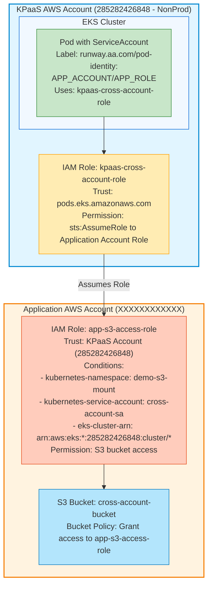

Skip to content
AAInternal
runway-kubernetes-cluster-automation
Repository navigation
Code
Issues
30
 (30)
Pull requests
103
 (103)
Agents
Discussions
Actions
Projects
Wiki
Security and quality
8
 (8)
Insights
Settings
S3 Mount on EKS using AWS Mountpoint for Amazon S3 CSI Driver #6501
sravanakinapally started this conversation in General
# S3 Mount on EKS using AWS Mountpoint for Amazon S3 CSI Driver


## Cross-Account S3 Access with Pod Identity

This section demonstrates how to access an S3 bucket in a different AWS account using EKS Pod Identity, following the KPaaS pod identity pattern.

**📖 AWS Documentation**: [Cross-account bucket access](https://github.com/awslabs/mountpoint-s3-csi-driver/blob/main/docs/CONFIGURATION.md#cross-account-bucket-access)

**📖 KPaaS Documentation**: [AWS Pod Identity](https://github.com/AAInternal/runway-kubernetes-cluster-automation/blob/main/docs/squad-docs/aws/pod-identity/pod-identity.md)

### Architecture Overview

```
┌─────────────────────────────────────────────────────────────────┐
│  KPaaS AWS Account (285282426848 - NonProd)                     │
│                                                                 │
│  ┌──────────────────────────────────────────────────────────┐   │
│  │  EKS Cluster                                             │   │
│  │                                                          │   │
│  │  ┌─────────────────────────────────────────────────┐     │   │
│  │  │  Pod with ServiceAccount                        │     │   │
│  │  │  ├─ Label: runway.aa.com/s3:          │     │   │
│  │  │  │    APP_ACCOUNT/APP_ROLE/S3-bucket                      │     │   │
│  │  │  └─ Uses: kpaas-cross-account-role              │     │   │
│  │  └─────────────────────────────────────────────────┘     │   │
│  └──────────────────────────────────────────────────────────┘   │
│                                                                 │
│  IAM Role: kpaas-cross-account-role (in KPaaS Account)          │
│  └─ Trust: pods.eks.amazonaws.com                               │
│  └─ Permission: sts:AssumeRole to Application Account Role      │
└─────────────────────────────────────────────────────────────────┘
                              │
                              │ Assumes Role
                              ▼
┌─────────────────────────────────────────────────────────────────┐
│  Application AWS Account (XXXXXXXXXXXX)                         │
│                                                                 │
│  IAM Role: app-s3-access-role (in Application Account)          │
│  ├─ Trust: KPaaS Account (285282426848) with conditions         │
│  │   ├─ kubernetes-namespace: demo-s3-mount                     │
│  │   ├─ kubernetes-service-account: cross-account-sa            │
│  │   └─ eks-cluster-arn: arn:aws:eks:*:285282426848:cluster/*   │
│  └─ Permission: S3 bucket access                                │
│                                                                 │
│  S3 Bucket: cross-account-bucket                                │
│  └─ Bucket Policy: Grant access to app-s3-access-role           │
└─────────────────────────────────────────────────────────────────┘
```



### Prerequisites

- S3 bucket in the Application AWS account
- IAM permissions in both KPaaS and Application AWS accounts
- EKS Pod Identity Agent installed (already configured in KPaaS clusters)

### Step 1: Create IAM Role in Application Account

**Responsibility:** Application Team

Create an IAM role in the Application AWS account with the following trust policy:

```json
{
    "Version": "2012-10-17",
    "Statement": [
        {
            "Effect": "Allow",
            "Principal": {
                "Service": "pods.eks.amazonaws.com"
            },
            "Action": [
                "sts:AssumeRole",
                "sts:TagSession"
            ]
        },
        {
            "Effect": "Allow",
            "Principal": {
                "AWS": "arn:aws:iam::285282426848:root"
            },
            "Action": [
                "sts:AssumeRole",
                "sts:TagSession"
            ],
            "Condition": {
                "StringEquals": {
                    "aws:RequestTag/kubernetes-namespace": "demo-s3-mount",
                    "aws:RequestTag/kubernetes-service-account": "cross-account-sa"
                },
                "StringLike": {
                    "aws:RequestTag/eks-cluster-arn": "arn:aws:eks:*:285282426848:cluster/*"
                }
            }
        }
    ]
}
```

**Permission Policy** for S3 access:

```json
{
    "Version": "2012-10-17",
    "Statement": [
        {
            "Effect": "Allow",
            "Action": [
                "s3:ListBucket"
            ],
            "Resource": [
                "arn:aws:s3:::cross-account-s3-kpaas"
            ]
        },
        {
            "Effect": "Allow",
            "Action": [
                "s3:GetObject",
                "s3:PutObject",
                "s3:DeleteObject"
            ],
            "Resource": [
                "arn:aws:s3:::cross-account-s3-kpaas/*"
            ]
        }
    ]
}
```

**Example Role ARN**: `arn:aws:iam::XXXXXXXXXXXX:role/app-s3-access-role`

### Step 2: Deploy Application with Pod Identity Label

**Responsibility:** Application Team

Create a webapp or deployment with the pod identity label:

```yaml
apiVersion: v1
kind: Namespace
metadata:
  name: demo-s3-mount
---
apiVersion: apps/v1
kind: Deployment
metadata:
  name: cross-account-app
  namespace: demo-s3-mount
  labels:
    app: cross-account-app
spec:
  replicas: 1
  selector:
    matchLabels:
      app: cross-account-app
  template:
    metadata:
      labels:
        app: cross-account-app
    spec:
      imagePullSecrets:
       - name: docker.aa.com.registry.creds
      serviceAccountName: cross-account-sa
      containers:
      - name: app
        image: docker.aa.com/prod/busybox
        command: ["sleep", "100000"]
        volumeMounts:
        - mountPath: "/data"
          name: s3-storage
      volumes:
      - name: s3-storage
        persistentVolumeClaim:
          claimName: cross-account-pvc
```

### Step 3: KPaaS Operator Creates IAM Resources

**Responsibility:** KPaaS Webapp Operator (Automated)

The webapp-operator automatically creates the following resources using [AWS Controllers for Kubernetes (ACK)](https://aws.amazon.com/blogs/containers/aws-controllers-for-kubernetes-ack/):

#### IAM Role in KPaaS Account

```yaml
apiVersion: iam.services.k8s.aws/v1alpha1
kind: Role
metadata:
  name: cross-account-role
  namespace: demo-s3-mount
spec:
  assumeRolePolicyDocument: '{"Version":"2012-10-17","Statement":[{"Effect":"Allow","Action":["sts:AssumeRole","sts:TagSession"],"Principal":{"Service":"pods.eks.amazonaws.com"}}]}'
  name: cross-account-role
  policyRefs:
  - from:
      name: cross-account-policy
      namespace: demo-s3-mount
```

#### IAM Policy for Cross-Account Access

```yaml
apiVersion: iam.services.k8s.aws/v1alpha1
kind: Policy
metadata:
  name: cross-account-policy
  namespace: demo-s3-mount
spec:
  name: cross-account-policy
  policyDocument: '{"Version":"2012-10-17","Statement":[{"Effect":"Allow","Action":["sts:AssumeRole","sts:TagSession"],"Resource":"arn:aws:iam::985149164908:role/cross-account-kpaas-role"}]}'
```

### Step 4: Create Pod Identity Association

**Responsibility:** KPaaS Webapp Operator (Automated)

The webapp-operator creates a pod identity association:

```yaml
apiVersion: eks.services.k8s.aws/v1alpha1
kind: PodIdentityAssociation
metadata:
  name: cross-account-pa
  namespace: demo-s3-mount
spec:
  clusterName: kaas-runway-lab-eks-1002-eastus
  namespace: demo-s3-mount
  roleARN: arn:aws:iam::285282426848:role/cross-account-role
  serviceAccount: cross-account-sa
  targetRoleARN: arn:aws:iam::985149164908:role/cross-account-kpaas-role
```

### Step 5: Create Kubernetes Resources for S3 Mount

#### ServiceAccount

```yaml
apiVersion: v1
kind: ServiceAccount
metadata:
  name: cross-account-sa
  namespace: demo-s3-mount
  labels:
    app.kubernetes.io/name: aws-mountpoint-s3-csi-driver
```

#### PersistentVolume and PersistentVolumeClaim  for Cross-Account Bucket

```yaml
apiVersion: v1
kind: PersistentVolume
metadata:
  name: cross-account-s3-pv
spec:
  capacity:
    storage: 2Gi
  accessModes:
    - ReadWriteMany
  storageClassName: ""
  claimRef:
    namespace: demo-s3-mount
    name: cross-account-pvc
  mountOptions:
    - allow-delete
    - region us-east-1
  csi:
    driver: s3.csi.aws.com
    volumeHandle: cross-account-s3-volume
    volumeAttributes:
      bucketName: cross-account-s3-kpaas  # Bucket in Application Account
      authenticationSource: pod  # Use pod-level credentials

---

apiVersion: v1
kind: PersistentVolumeClaim
metadata:
  name: cross-account-pvc
  namespace: demo-s3-mount
spec:
  accessModes:
    - ReadWriteMany
  storageClassName: ""
  resources:
    requests:
      storage: 1Gi
  volumeName: cross-account-s3-pv
```

### Verification

Test the cross-account S3 access:

```bash
# Check pod identity association
kubectl get podidentityassociation -n demo-s3-mount

# Check IAM resources created by ACK
kubectl get role.iam.services.k8s.aws -n demo-s3-mount
kubectl get policy.iam.services.k8s.aws -n demo-s3-mount

# Verify pod is running
kubectl get pods -n demo-s3-mount

# Test S3 access from the pod
❯ kk exec -it cross-account-app-55b7c45764-8swrp -- ls -ltr /data
total 0
drwxr-xr-x    2 1000     root             0 Jan 27 18:08 test123
drwxr-xr-x    2 1000     root             0 Jan 27 18:08 sample-app
```

### Key Differences from Same-Account Setup

1. **Two-Stage Role Chain**: Pod uses a role in KPaaS account → assumes role in Application account
2. **authenticationSource: pod**: Must use pod-level credentials instead of driver-level
3. **Trust Conditions**: Application role uses conditions to restrict which namespaces/service accounts can assume it
4. **Target Role ARN**: PodIdentityAssociation includes `targetRoleARN` pointing to Application account role
5. **Automated by Operator**: All IAM resources in KPaaS account are created by webapp-operator using ACK

### Notes

- The `runway.aa.com/pod-identity` label triggers the operator to create all necessary resources
- The EKS cluster ARN condition (`eks-cluster-arn: arn:aws:eks:*:285282426848:cluster/*`) allows pods across all KPaaS clusters to access the role
- Service account name must match the webapp name per KPaaS standardization

---

## Additional Resources

- [AWS Mountpoint for Amazon S3 CSI Driver](https://docs.aws.amazon.com/eks/latest/userguide/s3-csi.html)
- [Mountpoint for Amazon S3 on GitHub](https://github.com/awslabs/mountpoint-s3)
- [IAM roles for service accounts](https://docs.aws.amazon.com/eks/latest/userguide/iam-roles-for-service-accounts.html)
- [Mountpoint S3 CSI Driver Configuration](https://github.com/awslabs/mountpoint-s3-csi-driver/blob/main/docs/CONFIGURATION.md)
- [AWS Controllers for Kubernetes (ACK)](https://aws.amazon.com/blogs/containers/aws-controllers-for-kubernetes-ack/)
- [Amazon EKS Pod Identity streamlines cross-account access](https://aws.amazon.com/blogs/containers/amazon-eks-pod-identity-streamlines-cross-account-access/)


----

## same-Account S3 Access with Pod Identity

This guide demonstrates how to mount an S3 bucket as a persistent volume in an EKS cluster using the Mountpoint for Amazon S3 CSI driver.

### Reference Documentation

- [AWS EKS S3 CSI Driver Setup](https://docs.aws.amazon.com/eks/latest/userguide/s3-csi-create.html)

### Prerequisites

- AWS CLI configured with appropriate credentials
- `eksctl` installed
- `kubectl` installed
- An EKS cluster running
- An S3 bucket created (e.g., `kpaas-poc-s3`)

## Setup Overview

This guide walks you through the following steps:

1. **Create IAM Policy** - Set up permissions for S3 bucket access
2. **Update Kubeconfig** - Configure kubectl to connect to your EKS cluster
3. **Associate IAM OIDC Provider** - Enable IAM roles for service accounts (IRSA)
4. **Create IAM Service Account** - Link IAM role with Kubernetes service account
5. **Configure Namespace Security** - Enable privileged pod security for S3 CSI driver
6. **Create Kubernetes Resources** - Deploy PV, PVC, ServiceAccount, and test pods
7. **Deploy and Verify** - Apply resources and test S3 mount functionality
8. **Cleanup** - Remove all created resources when done

---

### Step 1: Create IAM Policy

Create an IAM policy that grants the necessary permissions to access the S3 bucket.

**📖 AWS Documentation**: [Create an IAM policy and role](https://docs.aws.amazon.com/eks/latest/userguide/s3-csi-create.html#s3-create-iam-policy)

**Policy ARN**: `arn:aws:iam::285282426848:policy/kpaas-poc-s3-mount-policy`


## Step 2: Update Kubeconfig

Configure kubectl to use your EKS cluster:

```bash
aws eks update-kubeconfig \
  --name kaas-runway-lab-eks-1002-eastus \
  --profile AWSAdminKPaaS-np
```

### Step 3: Associate IAM OIDC Provider

Enable IAM roles for service accounts (IRSA) by associating an OIDC provider with your cluster.

**📖 AWS Documentation**: [Create an IAM OIDC provider](https://docs.aws.amazon.com/eks/latest/userguide/enable-iam-roles-for-service-accounts.html)

```bash
eksctl utils associate-iam-oidc-provider \
  --region=us-east-1 \
  --cluster=kaas-runway-lab-eks-1002-eastus \
  --profile AWSAdminKPaaS-np \
  --approve
```

### Step 4: Create IAM Service Account

Create an IAM service account that will be used by pods to access S3.

**📖 AWS Documentation**: [Create Kubernetes service account](https://docs.aws.amazon.com/eks/latest/userguide/s3-csi-create.html#s3-create-kubernetes-sa)

```bash
CLUSTER_NAME=kaas-runway-lab-eks-1002-eastus
REGION=us-east-1
ROLE_NAME=kpaas-poc-s3-mount-role
POLICY_ARN=arn:aws:iam::285282426848:policy/kpaas-poc-s3-mount-policy

eksctl create iamserviceaccount \
    --name demo-s3-mount-sa \
    --namespace demo-s3-mount \
    --cluster $CLUSTER_NAME \
    --attach-policy-arn $POLICY_ARN \
    --approve \
    --role-name $ROLE_NAME \
    --region $REGION \
    --role-only \
    --profile AWSAdminKPaaS-np
```

**Created Role ARN**: `arn:aws:iam::285282426848:role/kpaas-poc-s3-mount-role`

### Step 5: Configure Namespace Security

Label the namespace to allow privileged pods (required for the S3 CSI driver):

```bash
kubectl label namespace demo-s3-mount \
  pod-security.kubernetes.io/enforce=privileged \
  pod-security.kubernetes.io/audit=privileged \
  pod-security.kubernetes.io/warn=privileged
```

## Step 6: Create Kubernetes Resources

**📖 AWS Documentation**: [Deploy a sample application and verify](https://docs.aws.amazon.com/eks/latest/userguide/s3-csi-create.html#s3-sample-app)

#### ServiceAccount

Create the ServiceAccount with the IAM role annotation:

```yaml
apiVersion: v1
kind: ServiceAccount
metadata:
  labels:
    app.kubernetes.io/name: aws-mountpoint-s3-csi-driver
  name: demo-s3-mount-sa
  namespace: demo-s3-mount
  annotations:
    eks.amazonaws.com/role-arn: arn:aws:iam::285282426848:role/kpaas-poc-s3-mount-role
```

#### PersistentVolume (PV)

Create a PersistentVolume that references your S3 bucket:

```yaml
apiVersion: v1
kind: PersistentVolume
metadata:
  name: s3-pv-demo
spec:
  capacity:
    storage: 2Gi
  accessModes:
    - ReadWriteMany
  storageClassName: "" # Required for static provisioning
  claimRef: # To ensure no other PVCs can claim this PV
    namespace: demo-s3-mount
    name: s3-pvc-demo
  mountOptions:
    - allow-delete
    - region us-east-1
  csi:
    driver: s3.csi.aws.com
    volumeHandle: s3-csi-driver-volume # Must be unique
    volumeAttributes:
      bucketName: kpaas-poc-s3
      authenticationSource: pod
```

#### PersistentVolumeClaim (PVC)

Create a PersistentVolumeClaim to bind to the PV:

```yaml
apiVersion: v1
kind: PersistentVolumeClaim
metadata:
  name: s3-pvc-demo
  namespace: demo-s3-mount
spec:
  accessModes:
    - ReadWriteMany # Supported options: ReadWriteMany / ReadOnlyMany
  storageClassName: "" # Required for static provisioning
  resources:
    requests:
      storage: 1Gi
  volumeName: s3-pv-demo # Name of your PV
```

#### Pod with Admin Access (Read/Write)

Create a pod with read and write access to the S3 bucket:

```yaml
apiVersion: v1
kind: Pod
metadata:
  name: busybox-admin-pod-level
  namespace: demo-s3-mount
  # Uncomment to disable Dynatrace injection if needed
  # annotations:
  #   oneagent.dynatrace.com/inject: "false"
  #   metadata-enrichment.dynatrace.com/inject: "false"
spec:
  imagePullSecrets:
    - name: docker.aa.com.registry.creds
  serviceAccountName: demo-s3-mount-sa
  containers:
    - name: busybox
      image: docker.aa.com/prod/busybox
      command: ["sleep", "100000"]
      volumeMounts:
        - mountPath: "/data"
          name: persistent-storage
  volumes:
    - name: persistent-storage
      persistentVolumeClaim:
        claimName: s3-pvc-demo
```

#### Pod with Read-Only Access

Create a pod with read-only access to the S3 bucket:

```yaml
apiVersion: v1
kind: Pod
metadata:
  name: busybox-read-only-pod-level
  namespace: demo-s3-mount
  # Uncomment to disable Dynatrace injection if needed
  # annotations:
  #   oneagent.dynatrace.com/inject: "false"
  #   metadata-enrichment.dynatrace.com/inject: "false"
spec:
  imagePullSecrets:
    - name: docker.aa.com.registry.creds
  serviceAccountName: demo-s3-mount-sa
  containers:
    - name: busybox
      image: docker.aa.com/prod/busybox
      command: ["sleep", "100000"]
      volumeMounts:
        - mountPath: "/data"
          name: persistent-storage
          readOnly: true
  volumes:
    - name: persistent-storage
      persistentVolumeClaim:
        claimName: s3-pvc-demo
```

#### Deployment

Apply all resources:

```bash
kubectl apply -f serviceaccount.yaml
kubectl apply -f pv.yaml
kubectl apply -f pvc.yaml
kubectl apply -f pod.yaml
```

#### Verification

Verify the setup:

```bash
# Check PV status
kubectl get pv s3-pv-demo

# Check PVC status
kubectl get pvc s3-pvc-demo -n demo-s3-mount

# Check pod status
kubectl get pods -n demo-s3-mount

# Test write access (admin pod)
kubectl exec -it busybox-admin-pod-level -n demo-s3-mount -- sh
# Inside the pod:
echo "Hello from EKS" > /data/test.txt
ls -la /data/

# Test read access (read-only pod)
❯ kubectl exec -it busybox-read-only-pod-level -n demo-s3-mount -- sh
/ # 
/ # cat /data/test.txt
Hello from EKS
/ # ls -la /data/
total 7
drwxr-xr-x    2 1000     root             0 Jan 27 01:04 .
drwxr-xr-x    1 root     root            75 Jan 27 01:04 ..
-rw-r--r--    1 1000     root          5976 Sep  6 23:07 AWSSupport-Troubleshootekscluster-Report-e258ef63-4ad0-40e8-ac10-af85dec5708d.txt
drwxr-xr-x    2 1000     root             0 Jan 27 01:04 backups
drwxr-xr-x    2 1000     root             0 Jan 27 01:04 s3-test
-rw-r--r--    1 1000     root            15 Jan 27 01:18 test.txt
```

#### Cleanup

Remove all resources:

```bash
kubectl delete pod busybox-admin-pod-level busybox-read-only-pod-level -n demo-s3-mount
kubectl delete pvc s3-pvc-demo -n demo-s3-mount
kubectl delete pv s3-pv-demo
```

#### Notes

- The `allow-delete` mount option allows deletion of files in the S3 bucket
- The `authenticationSource: pod` uses pod-level IAM authentication via the service account
- The S3 CSI driver requires privileged pod security enforcement
- Adjust the storage capacity, bucket name, and region according to your requirements

---

Replies:0 comments

Add a comment
Comment
 
Add your comment here...
Remember, contributions to this repository should follow its contributing guidelines.
Category
💬
General
Labels
AWS
1 participant
@sravanakinapally
Notifications
You’re not receiving notifications from this thread.
Footer
© 2026 GitHub, Inc.
Footer navigation
Terms
Privacy
Security
Status
Community
Docs
Contact
Manage cookies
Do not share my personal information

